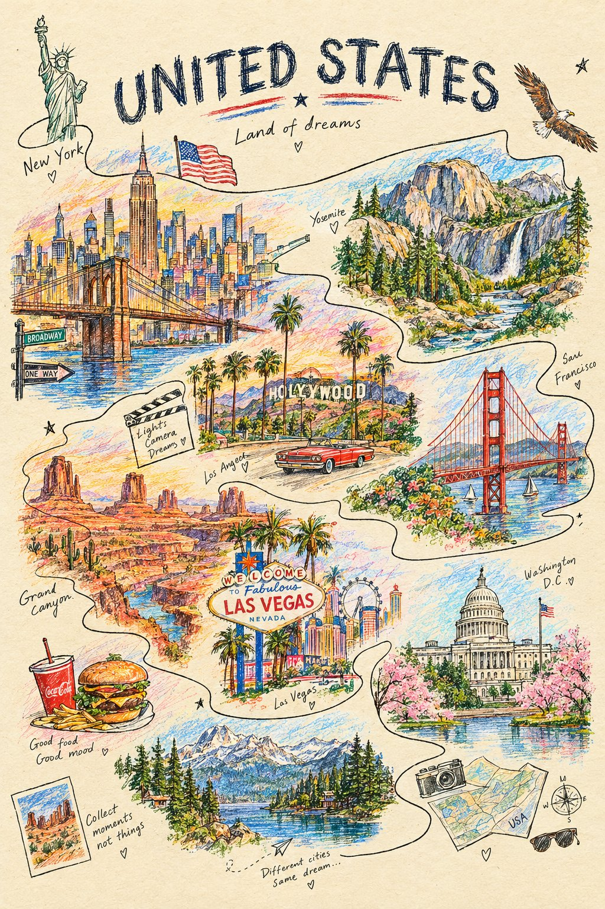

# Single Continuous-Line City Crayon Artwork

**中文标题：** 一笔连续线条城市彩铅蜡笔画  
**ID:** `gi25-x-672` · **Mode:** `generate`  
**Categories:** `poster-typography`  
**Tags:** `x-twitter`, `community`, `gpt-image-2.5`, `x-direct`, `en`



### Single Continuous-Line City Crayon Artwork

```text
Create a visually stunning minimalist colored-pencil and wax-crayon artwork of [CITY], where the entire city is constructed from one single continuous hand-drawn line. The line begins as a tiny cultural symbol, travels through famous architecture, streets, vehicles, trees, mountains, and everyday life, gradually forming an intricate panoramic cityscape. Add unexpected pops of bright wax-crayon color between the graphite lines, visible paper texture, imperfect handmade strokes, subtle smudges, playful scale changes, and tiny hidden details that reward zooming in. Clean ivory background, sophisticated editorial poster composition, artistic but recognizable, highly detailed, contemporary viral design aesthetic. Add “[CITY]” in bold refined typography at the top.
```

- **Recommended model:** `gpt-image-2.5-sunburst`
- **Settings:** _(defaults)_
- **Source:** [community](https://x.com/Naiknelofar788/status/2108048878234673467) — @Naiknelofar788
- **License note:** Original public X post; quoted with attribution — remix with attribution
- **Notes:** Collected directly from X; original post https://x.com/Naiknelofar788/status/2108048878234673467; post text names GPT Image 2.5; verified=True
- **Preview:** `previews/gi25-x-672.jpg`
