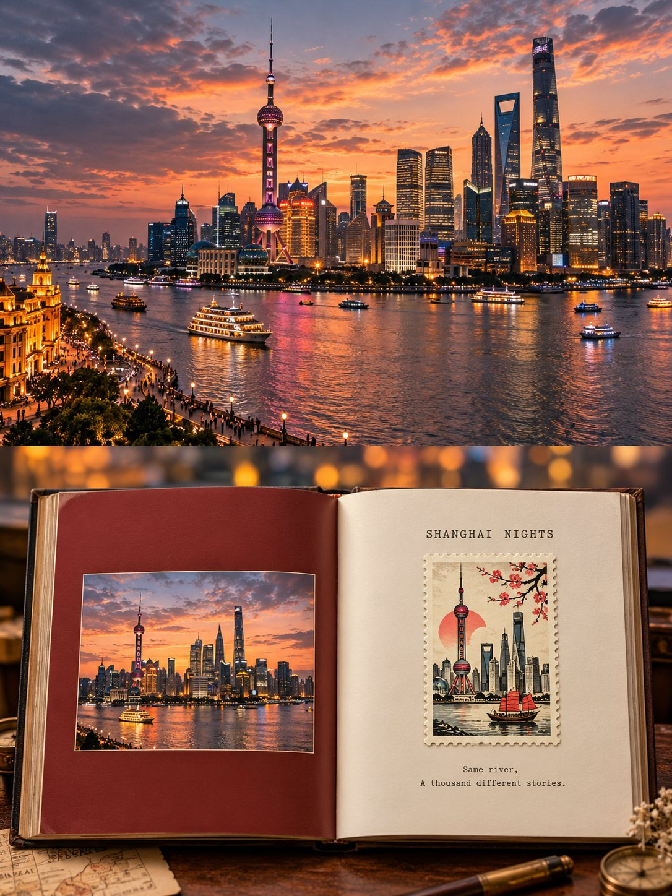

# Open-Book Travel-Memory Editorial Poster

**中文标题：** 翻开书页旅行回忆海报  
**ID:** `gi25-x-676` · **Mode:** `generate`  
**Categories:** `poster-typography`  
**Tags:** `x-twitter`, `community`, `gpt-image-2.5`, `x-direct`, `en`



### Open-Book Travel-Memory Editorial Poster

```text
Create a premium 3:4 vertical editorial travel-memory poster for [COUNTRY / CITY / LOCATION / SUBJECT].

TEXT-TO-IMAGE ONLY — generate the entire artwork creatively from [COUNTRY / CITY / LOCATION / SUBJECT] alone. No reference image required.

COMPOSITION
Divide the poster into two perfectly equal horizontal halves with no gap.

TOP HALF — CINEMATIC PHOTOGRAPH
Create a wide horizontal, photorealistic travel photograph representing [COUNTRY / CITY / LOCATION / SUBJECT]. Automatically choose the most meaningful subject, architecture, landscape, or moment associated with the destination.

The image must feel like an authentic editorial photograph: natural perspective, realistic lighting, subtle color grading, strong central subject, cinematic atmosphere, and believable environmental details.

BOTTOM HALF — OPEN-BOOK JOURNAL
Create one fully opened horizontal hardcover photography book centered in the lower half, viewed almost from above with slight realistic perspective.

The book should occupy roughly 86% of the lower-half width. The spine must sit exactly in the center, with perfectly equal left and right pages. Show realistic paper edges, thickness, spine curvature, soft shadows, and premium tactile paper.

LEFT PAGE
Fill the entire left page with one dominant color naturally extracted from the destination’s visual identity.

Place a smaller horizontal landscape photograph at the center of the page, showing the same destination or subject from the upper scene. Keep it rectangular, clean, and surrounded by an even generous border.

RIGHT PAGE
Use warm ivory paper with abundant negative space.

At the upper center, add one elegant 3–5 word ALL-CAPS English title inspired by the mood of the destination. Use small black typewriter-style serif lettering with subtle letter spacing.

Below it, place ONE perfectly upright vintage vertical postage stamp. Give it a cream perforated border, subtle paper texture, and a delicate shadow.

Inside the stamp, do not simply reproduce the main photograph. Instead, reinterpret 2–4 recognizable elements from the destination as a playful editorial illustration using bold hand-drawn black outlines, simplified shapes, and ONE bright accent color drawn from the scene.

Below the stamp, add two short centered lines of gentle poetic English text.

BACKGROUND
Outside the open book, create a softly blurred continuation of the destination’s environment. Preserve only its general colors, light, and atmosphere while keeping individual objects indistinct.

STYLE
Cinematic travel photography × contemporary photography monograph × open-book visual diary × vintage postage illustration × minimalist editorial design.

Warm, quiet, sophisticated, tactile, intimate, and collectible.

PRIORITIES
Perfect 50/50 top-bottom division → perfectly centered book spine → equal pages → strong horizontal photography → intact upright stamp → generous negative space.

Avoid portrait-oriented photo panels, blurred side bars, stretched imagery, invented landmarks, distorted architecture, uneven pages, tilted or cropped books, multiple stamps, excessive decoration, clutter, logos, watermarks, UI elements, or unnecessary typography.

FORMAT
3:4 vertical, two equal halves, premium editorial photography, realistic open-book construction, refined typography, cohesive travel-journal aesthetic.
```

- **Recommended model:** `gpt-image-2.5-sunburst`
- **Settings:** _(defaults)_
- **Source:** [community](https://x.com/Goodmanprotocol/status/2107760212962898088) — @Goodmanprotocol
- **License note:** Original public X post; quoted with attribution — remix with attribution
- **Notes:** Collected directly from X; original post https://x.com/Goodmanprotocol/status/2107760212962898088; post text names GPT Image 2.5; verified=True
- **Preview:** `previews/gi25-x-676.jpg`
