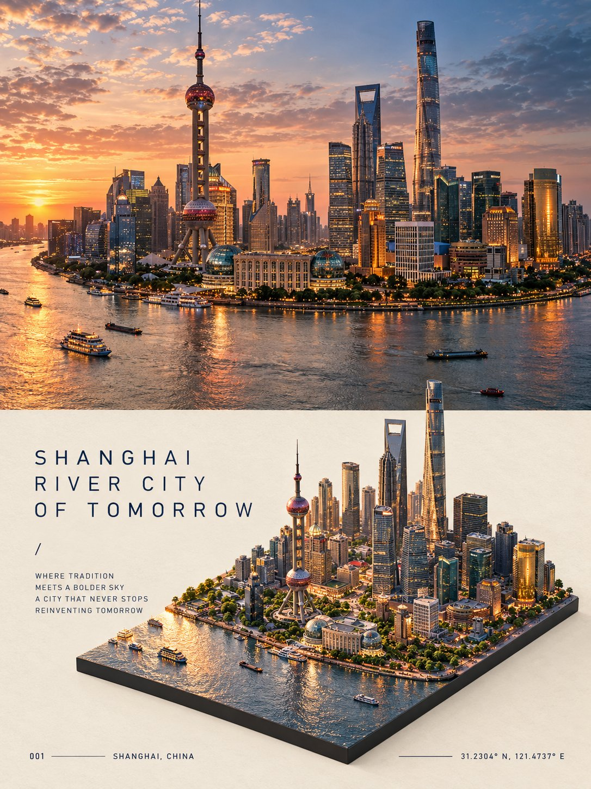

# Photoreal + Isometric Diorama Split Travel Poster

**中文标题：** 实景+等距微缩上下分屏旅行海报  
**ID:** `gi25-x-677` · **Mode:** `generate`  
**Categories:** `poster-typography`  
**Tags:** `x-twitter`, `community`, `gpt-image-2.5`, `x-direct`, `en`



### Photoreal + Isometric Diorama Split Travel Poster

```text
Create a premium 3:4 vertical editorial travel poster for [COUNTRY / CITY / LOCATION / SUBJECT].

TEXT-TO-IMAGE ONLY — generate the entire artwork creatively from [COUNTRY / CITY / LOCATION / SUBJECT] alone. No reference image required.

COMPOSITION
Divide the poster into two seamless stacked halves with no gap.

TOP HALF:
Create a full-width photorealistic cinematic travel scene representing [COUNTRY / CITY / LOCATION / SUBJECT]. Automatically choose its most recognizable architecture, surroundings, atmosphere, materials, colors, and natural lighting. Treat this as the authentic photographic view of the destination.

BOTTOM HALF:
Transform the same scene into a highly detailed isometric miniature diorama viewed from approximately a 45° elevated angle. Rebuild the recognizable architecture, streets, landscape, vegetation, and surrounding elements as a physically believable miniature world on a thin dark-gray rectangular base slab.

Maintain visual continuity between the upper photograph and lower diorama — same architecture, same environment, same lighting mood, and recognizable details — while making the lower section clearly handcrafted as a miniature.

EDITORIAL LAYOUT
Place the diorama toward the lower-right area, leaving generous warm off-white negative space around it.

Use thin dark-navy sans-serif typography in the empty space:
- a poetic 3-line uppercase title
- “/”
- a short 4-line travel verse
- bottom-left: “001” followed by a thin horizontal rule and [CITY / COUNTRY]
- bottom-right: a thin horizontal rule followed by accurate GPS coordinates

Automatically determine the appropriate city, country, landmark, and coordinates from [COUNTRY / CITY / LOCATION / SUBJECT].

STYLE
Photorealistic travel photography × hyper-detailed architectural miniature × premium editorial design × quiet luxury travel journal.

Use realistic materials, miniature-scale details, natural shadows, subtle depth of field, warm off-white paper, restrained dark-navy typography, and sophisticated negative space.

The lower diorama must feel physically constructed rather than like a flat illustration — tiny buildings, roads, vegetation, textures, shadows, and architectural details should have believable scale and depth.

FINAL AESTHETIC
Minimal, intelligent, atmospheric, collectible, and highly refined — a contemporary travel journal combining the real destination with its miniature architectural memory.

Avoid collage seams, separate unrelated scenes, generic architecture, invented landmarks, excessive typography, glossy CGI, cartoon styling, clutter, logos, watermarks, borders, and UI elements.

FORMAT
3:4 vertical, two stacked halves, no gap, upper photorealistic destination scene, lower isometric miniature diorama, premium editorial finish.
```

- **Recommended model:** `gpt-image-2.5-sunburst`
- **Settings:** _(defaults)_
- **Source:** [community](https://x.com/Goodmanprotocol/status/2107675234858131544) — @Goodmanprotocol
- **License note:** Original public X post; quoted with attribution — remix with attribution
- **Notes:** Collected directly from X; original post https://x.com/Goodmanprotocol/status/2107675234858131544; post text names GPT Image 2.5; verified=True
- **Preview:** `previews/gi25-x-677.jpg`
