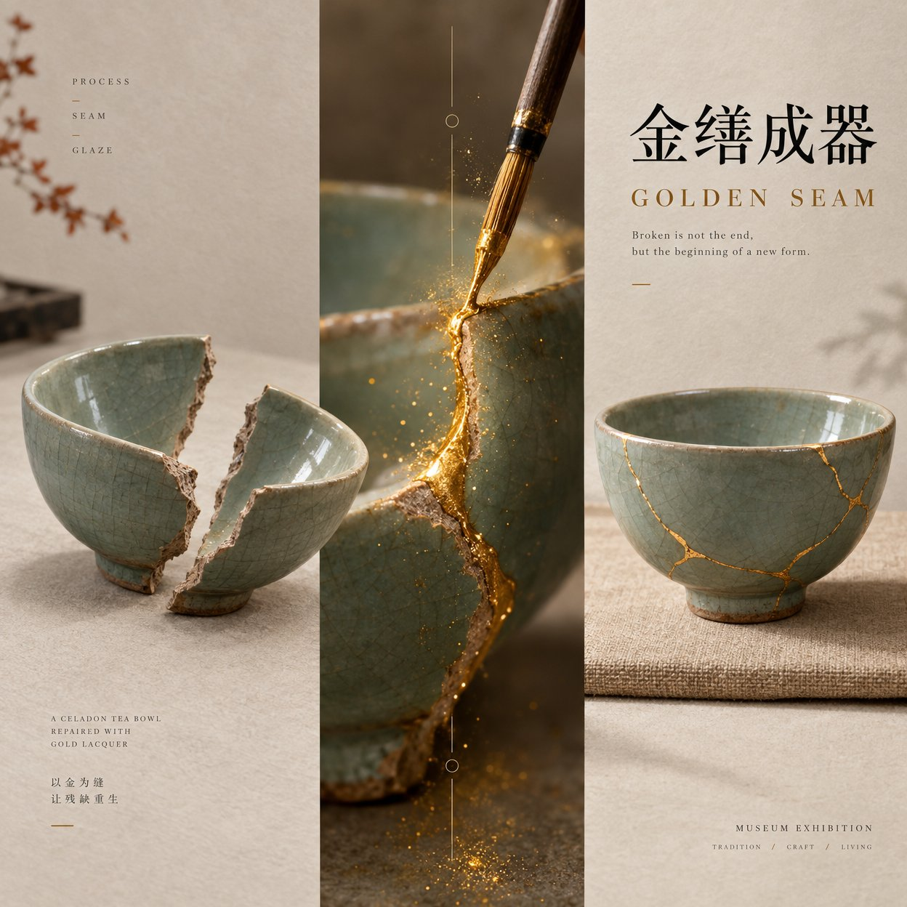

# Kintsugi Craft-Transformation Exhibition Poster

**中文标题：** 金缮工艺转化展览海报  
**ID:** `gi25-x-689` · **Mode:** `generate`  
**Categories:** `poster-typography`  
**Tags:** `x-twitter`, `community`, `gpt-image-2.5`, `x-direct`, `en`



### Kintsugi Craft-Transformation Exhibition Poster

```text
Theme: Kintsugi tea bowl repair Chinese title: 金缮成器 English title: GOLDEN SEAM Initial state / material: A cracked celadon tea bowl split into two pieces, cool gray-green glaze, visible raw clay fracture edges Transformation process: Fine gold lacquer seams being brushed along the cracks, tiny gold dust catching light Completed state: The same celadon bowl fully restored with luminous gold kintsugi lines, upright on a linen mat Central change axis: The gold lacquer repair seam itself — wet gold meeting clay fracture Correspondence: Crack / seam Main colors: celadon green, warm gold, ivory paper, soft charcoal Accent colors: muted rust Research node: PROCESS · SEAM · GLAZE Aspect ratio: 9:16

Generate a mature cultural exhibition poster with strong material expression and a craft-transformation central-axis composition.

The core is not two unrelated objects side by side — the material change itself becomes the composition.

Left side shows the INITIAL cracked celadon tea bowl pieces. Right side shows the COMPLETED gold-repaired bowl. Center is the critical craft moment where gold lacquer fills the fracture.

Viewers must understand without reading: original material → craft happening → finished state.

Left and right must truly belong together: the same bowl form, matching fracture edges that could rejoin, identical celadon glaze language.

The central axis is not a plain color band — it is where transformation occurs (gold lacquer meeting clay). Add 2–3 extremely restrained correspondence lines or process marks, never a process PPT.

Materials must read real: celadon glaze, raw clay, gold lacquer, linen, paper — clear stable surface logic. Do not replace material detail with noise or heavy aging.

Typography relates to the craft logic and may cross materials, sit near the central seam, or lightly intersect the subject. Avoid fixed four-character vertical stacks or one giant central character every time.

Include one small research node totaling about 6% of the frame (PROCESS / SEAM / GLAZE).

First glance: material contrast. Second: the central repair happening. Third: why left and right are one craft process.

Museum Exhibition Poster × Contemporary Editorial Graphic Design × East Asian Cultural Visual. High clarity, clean structure, concentrated information.

Avoid: unrelated left/right content, broken process logic, plastic materials, random cracks, excessive flame, complex tool diagrams, too many technical parameters, mechanical three-column layout, PPT info boxes, heavy aging, low-finish AI poster look.
```

- **Recommended model:** `gpt-image-2.5-sunburst`
- **Settings:** _(defaults)_
- **Source:** [community](https://x.com/Alyssa4aicreate/status/2108383348641214926) — @Alyssa4aicreate
- **License note:** Original public X post; quoted with attribution — remix with attribution
- **Notes:** Collected directly from X; original post https://x.com/Alyssa4aicreate/status/2108383348641214926; post text names GPT Image 2.5; verified=True; author credits inspiration to @MrLarus
- **Preview:** `previews/gi25-x-689.jpg`
