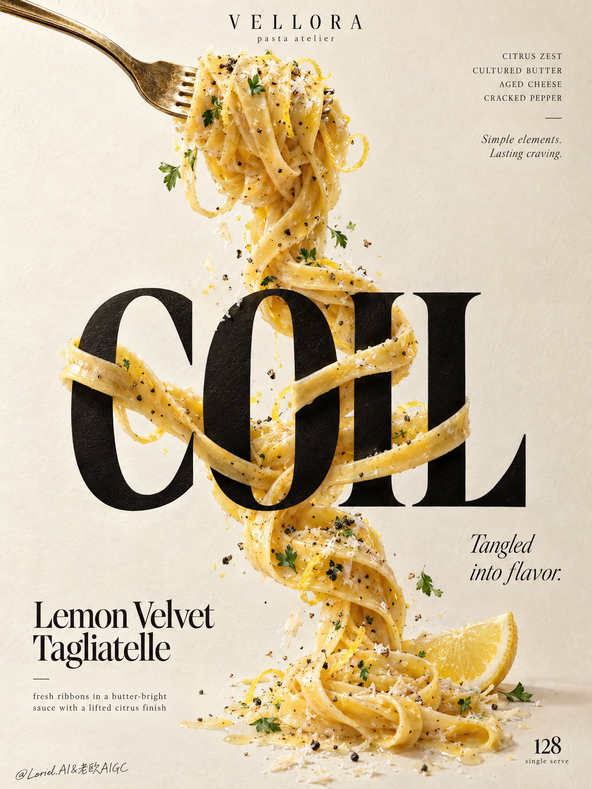

# Cannes-Grade Pasta Poster: One Continuous Strand

**中文标题：** 戛纳级意面海报：一根连续面条  
**ID:** `gi25-x-699` · **Mode:** `generate`  
**Categories:** `poster-typography`  
**Tags:** `x-twitter`, `community`, `gpt-image-2.5`, `x-direct`, `en`



### Cannes-Grade Pasta Poster: One Continuous Strand

```text
Create a Cannes-grade vertical poster ad for an original premium pasta brand, VELLORA, merging the warmth of a plated dish, the tactile authority of luxury food photography, and the restraint of a curator-led graphic poster. The core idea is a single continuous ribbon of lemon-butter tagliatelle physically twisting around typography, making pasta and letters structurally inseparable. The pasta remains the true visual hero, while the letter interaction delivers the conceptual impact.

Use a tall minimalist composition on a warm ivory paper-plaster background with subtle tactile grain and generous negative space. From the upper-left, a polished vintage-gold fork enters diagonally, holding a compact nest of glossy tagliatelle near the top center. From this lifted forkful, one continuous strand descends vertically through the poster, tightening, looping, crossing, and relaxing with believable weight and gravity. At the center, place one monumental ultra-bold black serif display word: "COIL". The pasta wraps around the letter stems, passes behind counters, crosses in front of key edges, and re-emerges with precise occlusion, natural contact shadows, and elegant tension. The strand continues below and resolves near the lower-right with a fresh lemon wedge accent, keeping the movement vertically unified.

Render the pasta with exceptional realism: silky ribbons with slight width variation, rich butter emulsion, subtle lemon zest, cracked black pepper, delicate grated aged cheese, and restrained parsley flecks. The noodles should feel freshly tossed, elastic, heavy, and luxurious, with visible drag, torsion, overlap, and sauce cling. Add only a few curated crumbs, pepper granules, zest curls, and tiny herb leaves close to the strand so the image feels alive without clutter. The fork must feel premium and tactile, with brushed metallic highlights, slight edge wear, and refined reflection control.

Typography must be entirely original and treated as graphic architecture. At the top center, place a small premium brand lockup reading "VELLORA" with the micro-line "pasta atelier". Top-right: "CITRUS ZEST / CULTURED BUTTER / AGED CHEESE / CRACKED PEPPER", with a small italic line beneath: "Simple elements. Lasting craving." The main central word is "COIL". In the lower-left, place "Lemon Velvet Tagliatelle", with the line "fresh ribbons in a butter-bright sauce with a lifted citrus finish". Mid-right: "Tangled into flavor." Bottom-right: a restrained numeric marker "128" with the tiny line "single serve". All lettering must feel custom-designed, beautifully kerned, spatially embedded, and tonally harmonized with the food, never crude, generic, or blocking the key pasta interaction.

Use soft directional daylight from the upper-left with refined studio discipline. The forkful catches creamy highlights, the black display word feels dense and premium without dead flat black, and the pasta carries luminous buttery reflections with layered shadows where it crosses the letters. Build a strong tonal step between the pale background, the dark central word, and the golden pasta so the concept reads instantly from a distance. Color hierarchy: 60% warm ivory and cream paper tones, 25% golden pasta and butter hues, 10% deep black typography, 5% lemon yellow and herb green accents. The overall mood is bright, tactile, elegant, modern, and quietly indulgent.

Materials must feel physically coherent and expensive: matte-ink or painted letter surface with subtle paper response, glossy butter-coated pasta with fine semolina texture, irregular grated cheese, crisp pepper granules, moist lemon flesh, and softly reflective metal. Hyper-real food photography merged with high-end editorial poster design, luxury print-ad finish, crisp readable text, believable gravity, clean background, strong product-first hierarchy, no clutter.

Avoid floating noodles without support logic, broken or melted strands, warped fork structure, unreadable text, generic menu-board styling, garnish overload, muddy shadows, dirty paper stains, dead black slabs, plastic-looking sauce, stiff pasta geometry, cheap glow, random particles, compositing artifacts, distorted letters, style drift, accidental resemblance to any real brand, or extra props that weaken the central noodle-and-typography interaction.
```

- **Recommended model:** `gpt-image-2.5-sunburst`
- **Settings:** _(defaults)_
- **Source:** [community](https://x.com/ou_zhen599/status/2108255531567898645) — @ou_zhen599
- **License note:** Original public X post; quoted with attribution — remix with attribution
- **Notes:** Collected directly from X; original post https://x.com/ou_zhen599/status/2108255531567898645; post text names GPT Image 2.5; verified=True
- **Preview:** `previews/gi25-x-699.jpg`
