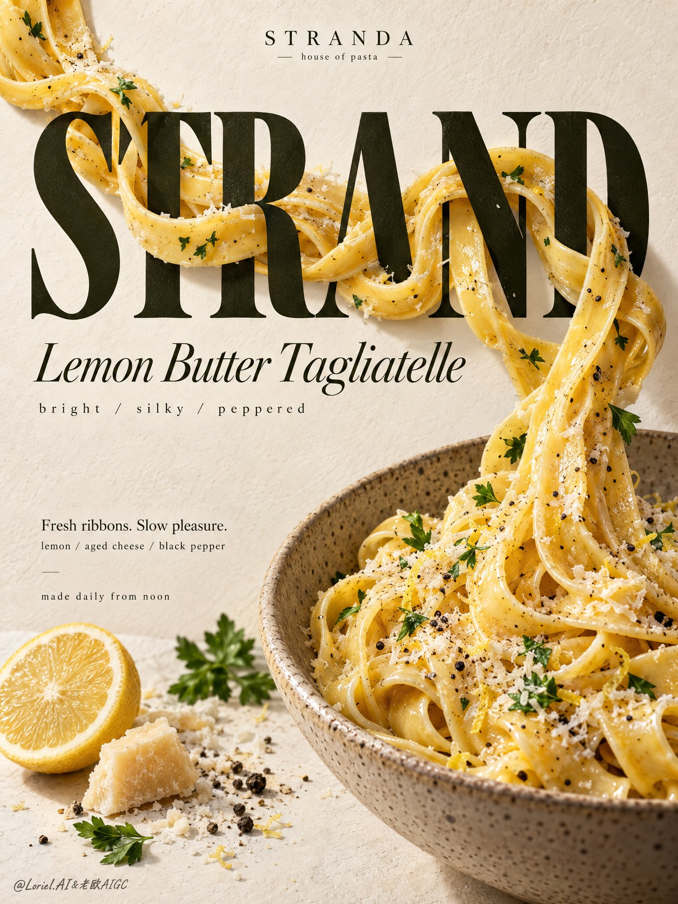

# Cannes-Grade Pasta Threading Through Serif Type

**中文标题：** 戛纳级意面穿插衬线大字海报  
**ID:** `gi25-x-700` · **Mode:** `generate`  
**Categories:** `poster-typography`  
**Tags:** `x-twitter`, `community`, `gpt-image-2.5`, `x-direct`, `en`



### Cannes-Grade Pasta Threading Through Serif Type

```text
Create a Cannes-grade vertical poster ad for an original premium pasta brand, STRANDA, built around real tagliatelle physically weaving through typography. Fuse hyper-real pasta, elegant editorial type, and clean gallery-grade food-poster language into one unified commercial composition. The product remains the absolute visual leader, while the noodle-letter interaction is the main conceptual impact point.

Use a refined vertical editorial food-poster layout. Across the upper-middle field, place a monumental dark olive-black serif display word, "STRAND", tall, bold, sculptural, and spanning most of the poster width. Thick glossy ribbons of lemon-butter tagliatelle physically thread across, behind, and through the letterforms with believable overlap, occlusion, drag, and tension. Some strands pass in front catching creamy highlights, some disappear behind stems, some curve through negative spaces and re-emerge, creating a precise reveal-and-conceal rhythm. The noodle flow begins near the upper-left of the title, crosses the central letters, then descends diagonally into a large speckled ceramic bowl in the lower-right quadrant, partially cropped by the frame edge to enlarge presence and maintain poster tension.

The hero dish must be intensely appetizing and highly realistic: silky tagliatelle coated in buttery lemon emulsion, faint zest shimmer, cracked black pepper, finely grated aged cheese, and restrained flat-leaf parsley accents. The noodles should feel elastic, freshly tossed, hand-made, and heavy enough to pull naturally, with visible torsion, thickness variation, and sauce cling. The bowl is warm stoneware with fine speckling, matte glaze, realistic rim thickness, and subtle ceramic depth. Supporting ingredients stay minimal and curated: a half lemon, one small shard of aged cheese, a little cheese dust, a few peppercorns, and a few parsley leaves in the lower-left field, arranged as editorial punctuation rather than clutter.

The background is a warm ivory paper-plaster surface with soft tactile grain, functioning as a luxury print-poster ground rather than a literal kitchen. Keep it distilled and clean but not sterile: enough texture to feel premium and physical, never dirty. Merge three directions into one result: emotional comfort of an inviting plated dish, tactile authority of pasta and ceramic realism, and curatorial restraint of a minimalist design poster. The image should feel abundant yet disciplined.

Use soft directional daylight from the upper-left with controlled studio refinement. Build creamy highlights on the butter-coated noodles, low-relief shadow on the typography, delicate cast shadows where pasta crosses letters, and stronger separation between the dark word block, golden pasta ribbons, and pale ground. Color hierarchy: 60% warm ivory, cream, and soft stone; 30% golden pasta, butter, and toasted cheese tones; 10% dark olive-black typography with restrained citrus yellow and parsley green accents. Contrast should be stronger than a casual menu poster but still elegant, clean, and premium.

Typography must be fully original and treated as graphic architecture. Top center: "STRANDA" with the small line "house of pasta". Main central display word: "STRAND". Beneath it: "Lemon Butter Tagliatelle". Below that: "bright / silky / peppered". In the lower-left text zone: "Fresh ribbons. Slow pleasure." and "lemon / aged cheese / black pepper". Near the bottom-left: "made daily from noon". All text must feel custom-designed, beautifully kerned, spatially integrated, and tonally harmonized with the noodle movement. No crude fonts, no generic heavy black text, no text covering the key pasta interaction or bowl.

Hyper-real food photography merged with high-end editorial poster design, luxury food-ad finish, strong product-first hierarchy, believable gravity and contact, crisp readable text, elegant negative space, clean premium print feel, unified art direction. No clutter, extra dishes, garnish overload, floating noodles, broken strands, warped bowl geometry, unreadable text, muddy background stains, dead black patches, plastic-looking sauce, stiff pasta geometry, cheap menu-board look, style drift, or unnecessary decorative effects.
```

- **Recommended model:** `gpt-image-2.5-sunburst`
- **Settings:** _(defaults)_
- **Source:** [community](https://x.com/ou_zhen599/status/2108253336592171180) — @ou_zhen599
- **License note:** Original public X post; quoted with attribution — remix with attribution
- **Notes:** Collected directly from X; original post https://x.com/ou_zhen599/status/2108253336592171180; post text names GPT Image 2.5; verified=True
- **Preview:** `previews/gi25-x-700.jpg`
