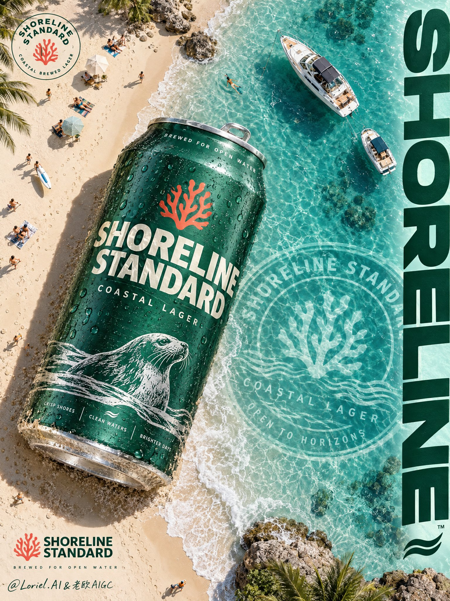

# Giant Beer Can on the Shoreline Ad Poster

**中文标题：** 海岸线巨型啤酒罐广告海报  
**ID:** `gi25-x-701` · **Mode:** `generate`  
**Categories:** `poster-typography`, `ecommerce`  
**Tags:** `x-twitter`, `community`, `gpt-image-2.5`, `x-direct`, `en`



### Giant Beer Can on the Shoreline Ad Poster

```text
Create a Cannes-level vertical poster ad for an original overseas beer brand, SHORELINE STANDARD: a premium coastal lager campaign where a hyper-real chilled can and a sunlit shoreline merge into one physically believable, graphically commanding image. The can is the absolute visual leader; the beach, sea, boats, underwater seal, and typography function as one unified brand system.

Use a high-angle near-top-down view with a slight diagonal tilt. A giant emerald-green aluminum can lies diagonally across the border between pale sand and shallow turquoise water, occupying the central-left field and dominating the poster. The shoreline creates a clean diagonal split. The can feels oversized but grounded, with its lower body pressing slightly into the sand and its upper side nearing the waterline. In the upper beach zone, add tiny sunbathers, towels, footprints, and sparse miniature leisure activity as scale rhythm only, never portrait subjects. In the upper-right water area, place two elegant leisure boats near shore. On the right half beneath the water, embed a huge semi-transparent circular brand seal. Along the far-right edge, place a bold vertical brand wordmark as a clean graphic column.

The hero can must feel premium and hyper-real: cold aluminum realism, dense micro-condensation, varied droplet size, fine embossed texture, crisp print registration, realistic pull-tab, silver rim detail, subtle natural scuffs, and believable wet metallic sheen. Brand design is original and iconic: deep emerald base, off-white lettering, restrained coral-red emblem, refined silver details. Primary can text: "SHORELINE STANDARD", "COASTAL LAGER", "BREWED FOR OPEN WATER". Any other can text should stay minimal, premium, and art-directed.

Build a tropical shoreline with creamy warm sand, translucent mint-to-turquoise shallows, delicate foam traces, visible shallow seabed gradients, and clean coastal clarity. Keep the beach real but edited toward a design-led ad aesthetic: airy spacing, elegant negative space, simplified micro-activity, no clutter. The giant can, underwater seal, and right-edge typography must feel like one integrated poster logic.

Use bright coastal afternoon sunlight from the upper-left. Light cuts crisply across the can, emphasizing condensation, casting a soft shadow over the sand, adding luminous sparkle on the water, and creating clear tonal separation between lit metal, shaded undercurve, pale shoreline, and translucent sea. Color system: 60% luminous aqua, sea-glass green, pale coastal light; 30% warm sand, soft ivory, muted mineral beige; 10% saturated emerald product tones with restrained coral-red accents. The feeling is fresh, premium, expansive, and sharply art-directed, with stronger contrast than a flat lifestyle image while staying clean and elegant.

Materials must be highly convincing: cold tactile aluminum, realistic droplet adhesion and highlight response, fine granular sand with slight compression under the can, shallow refractive water with subtle distortion over the embedded seal so it feels submerged yet readable. Boats are realistic and crisp but secondary. The whole poster should carry luxury FMCG finish, museum-clean composition, and international ad-award polish.

Typography must be fully original and treated as graphic architecture. Top-left: a small premium circular badge reading "SHORELINE STANDARD" with "coastal brewed lager". Right edge: a large vertical wordmark "SHORELINE" in a bold custom rounded sans-serif, functioning as a green graphic pillar. Underwater circular seal on the right half: "SHORELINE STANDARD", "COASTAL LAGER", and "OPEN TO HORIZONS" as a translucent emblem. Bottom-left: a compact logo lockup using the coral-red emblem beside "SHORELINE STANDARD". All text must feel polished, spatially embedded, tonally unified, never crude, flat black, or blocking the can.

Luxury commercial poster, product-first hierarchy, precise scale contrast, crisp readable typography, unified brand system, clean negative space, realistic boats, realistic miniature beach figures, grounded can placement, hyper-detailed condensation, elegant diagonal structure, premium print-poster finish. No clutter, warped can geometry, broken pull-tab, unreadable text, accidental resemblance to any real beer brand, muddy shadows, dead black patches, floating objects, malformed people, distorted boats, cheap glow, over-saturated water, random decorative debris, compositing artifacts, or weak product emphasis.
```

- **Recommended model:** `gpt-image-2.5-sunburst`
- **Settings:** _(defaults)_
- **Source:** [community](https://x.com/ou_zhen599/status/2108252496737292631) — @ou_zhen599
- **License note:** Original public X post; quoted with attribution — remix with attribution
- **Notes:** Collected directly from X; original post https://x.com/ou_zhen599/status/2108252496737292631; post text names GPT Image 2.5; verified=True
- **Preview:** `previews/gi25-x-701.jpg`
