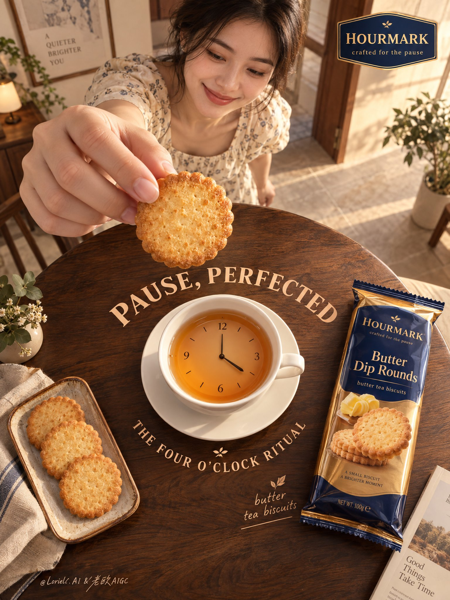

# Four O'Clock Tea Cup-Clock Biscuit Ad Poster

**中文标题：** 下午四点茶杯时钟饼干广告海报  
**ID:** `gi25-x-702` · **Mode:** `generate`  
**Categories:** `poster-typography`, `ecommerce`  
**Tags:** `x-twitter`, `community`, `gpt-image-2.5`, `x-direct`, `en`



### Four O'Clock Tea Cup-Clock Biscuit Ad Poster

```text
Create a Cannes-grade vertical poster ad for an original overseas biscuit brand, HOURMARK, with Butter Dip Rounds as the absolute hero. Preserve the exact logic of a high-overhead ultra-wide lifestyle poster: a large round dark walnut table fills the lower two-thirds as the main stage; at its center, a white ceramic teacup fused with a minimal analog clock face forms the conceptual core. In the upper frame, a smiling young woman stands beyond the table, secondary in scale, reaching from the upper-left toward the camera, delicately holding one biscuit very close to the lens directly above the cup-clock, freezing the instant before dipping. On the right side of the table, place the premium biscuit pack diagonally, fully readable. On the lower-left, place a small tray with three extra biscuits. Preserve the circular composition, the foreground-to-center-to-product visual loop, generous negative space, and elegant tabletop typography rhythm.

Set this in a refined domestic interior edited into a premium lifestyle set: blush clay and muted butter-cream walls, warm walnut furniture, pale stone floor, sparse indoor greenery, framed wall art, and one open doorway with soft depth. Keep the environment realistic but gallery-clean so nothing competes with the product. The woman should feel authentic, warm, and approachable, with natural dark hair, an understated ivory floral dress, and a relaxed smile toward the biscuit and cup. She is emotional context only, never stronger than the product.

The hero biscuit must look hyper-real and edible: crisp baked pores, scalloped edge, golden toasted gradient, dry buttery surface, believable thickness, subtle crumbs. The packaging must feel premium and physically convincing, in amber gold, deep cobalt, and brushed copper, with realistic laminated reflections, precise crimped edges, clean print registration, and premium FMCG proportions. The walnut tabletop shows rich grain and soft specular rolloff. The cup-clock is smooth white ceramic with a matte dial and slim dark hands; the tea surface shows controlled amber reflection and a gentle meniscus.

Use late-afternoon four-o’clock light as the narrative anchor. Main light enters from the right-back side, soft but directional, wrapping across the fingers, biscuit texture, cup rim, and pack edges. Build refined contrast so the product gains volume and authority. Add subtle floor bounce and environmental fill to avoid dead blacks. Keep shadows warm, transparent, and clean. Color system: 60% warm cream, blush clay, pale stone; 30% walnut brown, toasted biscuit gold, amber tea; 10% cobalt and copper accents on the pack and selected graphic details. The overall image should feel premium, tactile, calm, and sharply art-directed.

Typography must be original, not copied, and integrated as graphic composition within the scene. In the top-right, place a small premium logo badge reading "HOURMARK" with the micro-line "crafted for the pause". Around the cup-clock and tabletop arc, integrate custom rounded display lettering in warm cream and apricot tones: "PAUSE, PERFECTED" and "THE FOUR O'CLOCK RITUAL". Near the pack, place a small elegant product note: "butter tea biscuits". Typography should feel polished, sculpted, and spatially embedded, sharing the same light and color logic, never flat black text, and never blocking the biscuit, hand, or packaging.

Commercial poster finish, hyper-real product rendering, product-first hierarchy, elegant perspective, believable anatomy, unified light logic, clean negative space, coherent object contact, subtle luxury print sensibility, refined advertising concept, museum-clean composition, high material readability. No clutter, random particles, decorative crystals, floating objects, duplicated products, broken fingers, warped biscuit geometry, malformed hands, unreadable or gibberish text, pack distortion, perspective collapse, muddy haze, dirty shadows, dead black patches, overdone CGI gloss, style drift, irrelevant props, extra branding, human name, or cheap poster effects.
```

- **Recommended model:** `gpt-image-2.5-sunburst`
- **Settings:** _(defaults)_
- **Source:** [community](https://x.com/ou_zhen599/status/2108178899305955696) — @ou_zhen599
- **License note:** Original public X post; quoted with attribution — remix with attribution
- **Notes:** Collected directly from X; original post https://x.com/ou_zhen599/status/2108178899305955696; post text names GPT Image 2.5; verified=True
- **Preview:** `previews/gi25-x-702.jpg`
