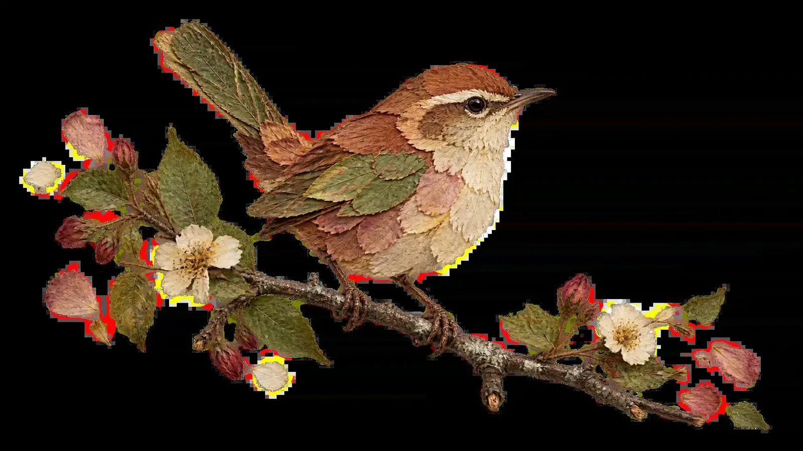

# Pressed-Flower Wren Cutout

**中文标题：** 压花鹪鹩透明剪影  
**ID:** `gi25-x-178` · **Mode:** `generate`  
**Categories:** `product-cutout`, `general`  
**Tags:** `alosem`, `community`, `gpt-image-2.5`, `seeapi`, `en`



### Pressed-Flower Wren Cutout

```text
A pressed-flower collage artwork (oshibana) forming one irregularly shaped scene slice floating free with no background at all: the area surrounding the slice is completely transparent (alpha = 0) - not white, not colored, no surface, no checkerboard pattern. The slice holds one small complete scene composed entirely from real pressed flowers, petals, leaves, and stems: a small wren perched on a slender real pressed twig, its body built from layered rust, ochre, and dusty-rose petals with a cream petal breast, moss-green leaf pieces for wing and tail, and a tiny dried-grass eye-line, the twig textured with natural bark irregularity. Every element keeps the honest character of pressed botanicals - natural irregular petal edges, fine veining, delicate layered lift. At its boundary the piece ends the way pressed arrangements end: a few loose petals, tiny leaf fragments, and one small dried blossom scatter onto the transparency, so the artwork looks finished at its heart and unfinished at its rim.

The slice sits fully intact with clear transparent margin on every side; the transparency extends uniformly to all four borders of the canvas. Soft even light with delicate dimensional petal shadows only within the slice. No text appears anywhere. 16:9 wide composition.
```

- **Recommended model:** `gpt-image-2.5-sunburst`
- **Settings:** _(defaults)_
- **Source:** [community](https://alosem.com/i/pressed-flower-wren-on-twig-slice-4712aff7) — @rafael_nascimento (via SeeAPI/awesome-gpt-image-2.5-prompts)
- **License note:** Alosem gallery item mirrored in SeeAPI/awesome-gpt-image-2.5-prompts; remix with attribution
- **Notes:** SeeAPI P73 (p73-pressed-flower-wren-cutout)
