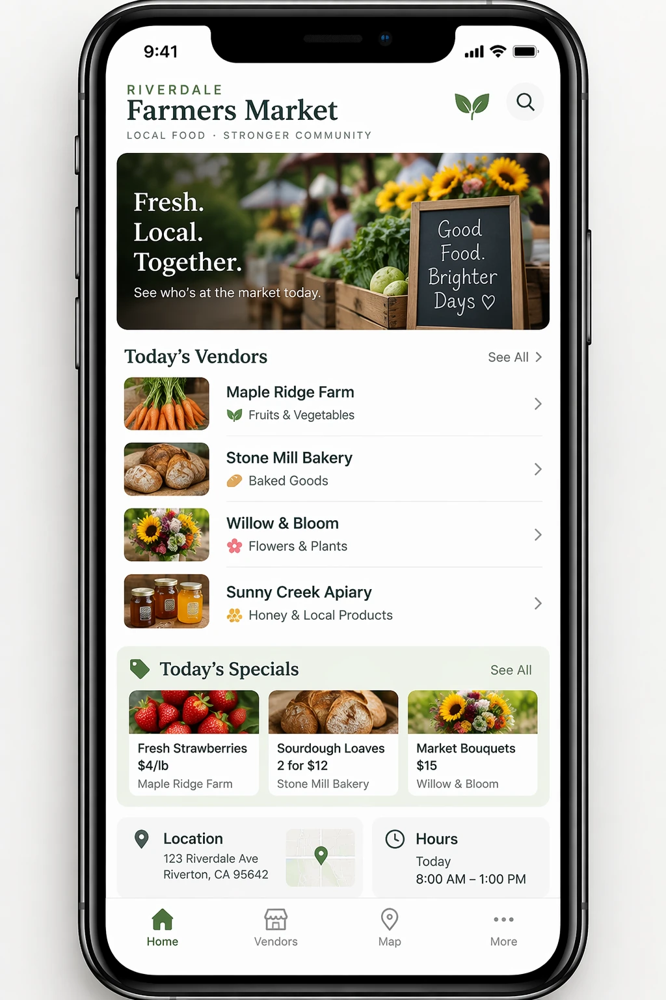

# Farmers market iPhone UI mockup

**中文标题：** 农贸市场 App iPhone UI 样机  
**ID:** `gi25-ui-001` · **Mode:** `generate`  
**Categories:** `ui-mockup`  
**Tags:** `mobile`, `app`, `openai-official`  



### Farmers market iPhone UI mockup

```text
Create a realistic mobile app UI mockup for a local farmers market.
Show today's market with a simple header, a short list of vendors with small photos and categories, a small "Today's specials" section, and basic information for location and hours.
Design it to be practical, and easy to use. White background, subtle natural accent colors, clear typography, and minimal decoration.
It should look like a real, well-designed, beautiful app for a small local market.
Place the UI mockup in an iPhone frame.
```

- **Recommended model:** `gpt-image-2.5-flare`
- **Settings:** `quality=medium`, `size=1024x1536`
- **Source:** [OpenAI Image prompting](https://developers.openai.com/api/docs/guides/image-prompting) — OpenAI
- **License note:** OpenAI docs examples
