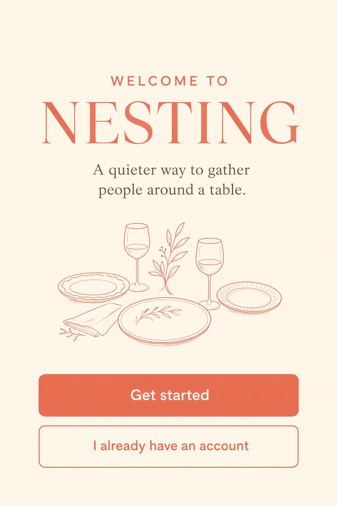

# NESTING mobile onboarding screen

**中文标题：** NESTING 移动端引导页  
**ID:** `gi25-ui-004` · **Mode:** `generate`  
**Categories:** `ui-mockup`  
**Tags:** `onboarding`, `exact-text`, `fal`  



### NESTING mobile onboarding screen

```text
Create a vertical mobile onboarding screen for a fictional app called NESTING.
Headline: WELCOME TO NESTING.
Supporting line: A quieter way to gather people around a table.
Buttons: Get started, I already have an account.
Small line illustration of three plates and two wine glasses.
Warm cream background, coral primary button, rounded sans serif,
clean spacing, exact readable copy.
No watermark. No real app branding.
```

- **Recommended model:** `gpt-image-2.5-flare`
- **Settings:** _(defaults)_
- **Source:** [Vendor blog](https://fal.ai/learn/tools/prompting-gpt-image-2) — Ilker Izgi / fal
- **License note:** fal blog examples; adapt for 2.5
