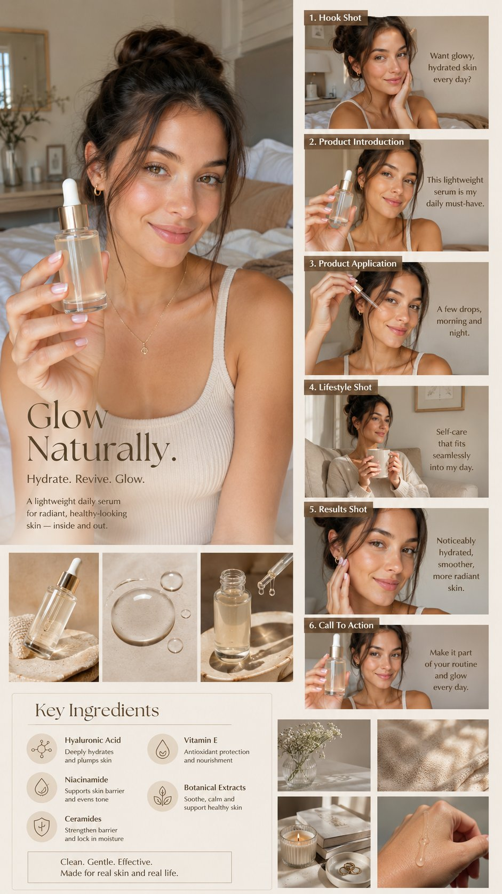

# Skincare UGC Storyboard Board

**中文标题：** 护肤 UGC 分镜板  
**ID:** `gi25-x-004` · **Mode:** `generate`  
**Categories:** `ui-mockup`  
**Tags:** `x-twitter`, `evolink`, `community`, `gpt-image-2`



### Skincare UGC Storyboard Board

```text
(Luxury AI UGC skincare campaign board), warm beige aesthetic, beautiful female influencer with glowing healthy skin, holding a skincare serum bottle toward the camera, natural smile, cozy bedroom environment, soft natural daylight, realistic home setting, elegant neutral decor.

Large hero portrait on the left side.

Right side featuring (6 UGC storyboard panels):
(Hook Shot),
(Product Introduction),
(Product Application),
(Lifestyle Shot),
(Results Shot),
(Call To Action).

Each panel showing realistic influencer actions and natural expressions.

Bottom section featuring (Key Ingredients Box) with elegant skincare icons and ingredient highlights.

Additional product close-ups, serum texture shots, lifestyle B-roll images, premium beauty advertising layout.

(Soft Natural Lighting),
(Real & Relatable),
(Clean Editorial Design),
(UGC Creator Style),
(Premium Skincare Branding),
(Warm Beige Color Palette),
(Photorealistic),
(Ultra Detailed),
(Vertical 9:16),
(8K Quality).

Negative Prompt:
watermark, logo, low quality, blurry, bad anatomy, distorted hands, cluttered layout, dark lighting, cartoon, CGI.
```

- **Recommended model:** `gpt-image-2.5-sunburst`
- **Settings:** _(defaults)_
- **Source:** [X/Twitter](https://x.com/WanderingC76/status/2063797516731294055) — @WanderingC76 (via EvoLinkAI)
- **License note:** CC0-1.0 (EvoLink catalog); original X post — remix with attribution
- **Notes:** Mirrored in EvoLink case 414 (ui.md); original post on X.
