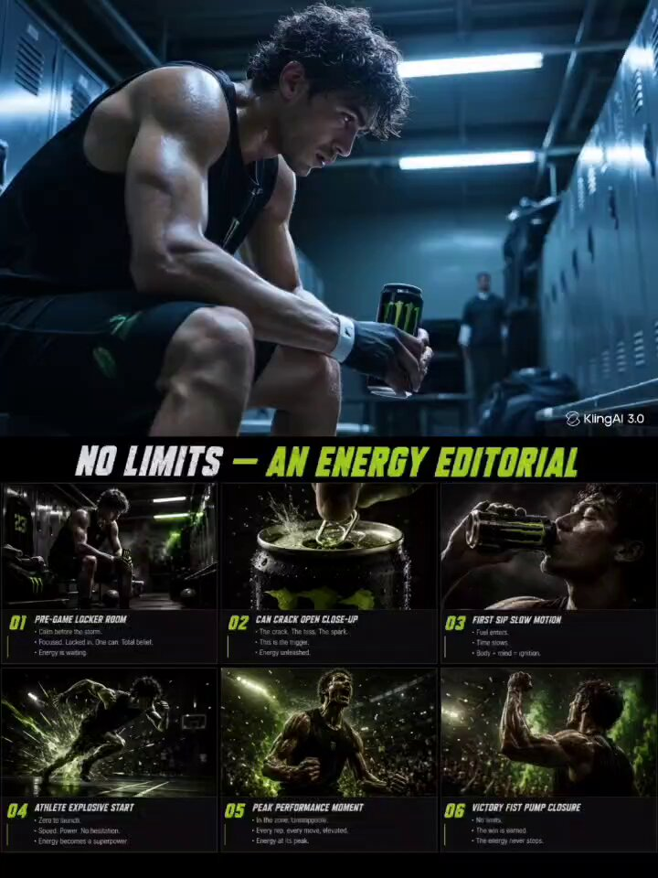

# Energy Drink Storyboard Grid

**中文标题：** 能量饮料广告分镜网格  
**ID:** `gi25-x-005` · **Mode:** `edit`  
**Categories:** `ui-mockup`  
**Tags:** `x-twitter`, `evolink`, `community`, `gpt-image-2`



### Energy Drink Storyboard Grid

```text
- Create a high-energy 16:9 energy drink advertising storyboard in 3x2 grid (6 frames), editorial layout, Monster/Red Bull style, matte black + electric green palette. Structured flow: pre-game locker room, can crack open close-up, first sip slow motion, athlete explosive start, peak performance moment, victory fist pump closure. Each frame split: top cinematic image (no text) + bottom storyboard notes. Underground sports aesthetic, zero to hundred mood, energy as superpower. A single energy drink can cracking open is the emotional center throughout. Add a bold heading at the top of the storyboard in aggressive bold font reading: NO LIMITS — AN ENERGY EDITORIAL.

KLING AI 3.0 PROMPT :- This is a storyboard image containing 6 frames arranged in a 3x2 grid. Treat each frame as a separate sequential scene. Animate every frame one by one from left to right, top to bottom. Start from frame 1 top-left, then frame 2, then frame 3, then frame 4, then frame 5, end with frame 6 bottom-right. Each frame must play for exactly 2.5 seconds. Total video duration 15 seconds. Do not merge frames together. Do not skip any frame. Do not loop. Play each frame in strict order as one continuous uninterrupted cinematic video. Use locker room fluorescent light flickering over athlete in pre-game silence, can tab cracking open with mist spray in extreme slow motion macro, first sip with throat gulp visible and eyes sharpening in real time, explosive sprint start with ground crack effect and motion blur, peak performance jump with sweat flying off body in slow motion, victory fist pump with crowd blur and electric green light flare. Add subtle motion within each frame only, smooth dissolve transitions between frames. Lighting transitions from cold locker room fluorescent blue to electric green can crack flash to harsh outdoor performance sun to victory green flare closure. Underground sports aesthetic, zero to hundred raw energy mood, drink as pure superpower. A single energy drink can cracking open remains the emotional focus across all 6 frames. Ultra-realistic, 4K photographic quality, no cartoon style.
```

- **Recommended model:** `gpt-image-2.5-sunburst`
- **Settings:** _(defaults)_
- **Source:** [X/Twitter](https://x.com/Strength04_X/status/2063256718902219255) — @Strength04_X (via EvoLinkAI)
- **License note:** CC0-1.0 (EvoLink catalog); original X post — remix with attribution
- **Notes:** Mirrored in EvoLink case 405 (ui.md); original post on X.
