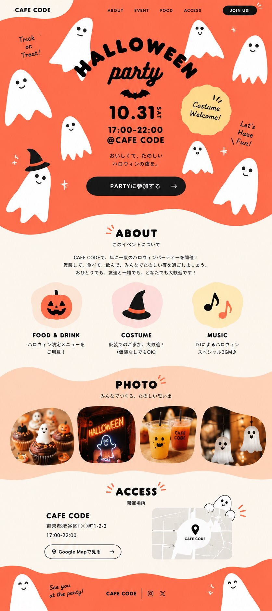

# Canva → Images 2.5 → Codex Halloween LP Draft

**中文标题：** Canva→Images 2.5→Codex：约10分钟万圣节LP草稿  
**ID:** `gi25-x-484` · **Mode:** `generate`  
**Categories:** `ui-mockup`, `poster-typography`  
**Tags:** `x-twitter`, `community`, `gpt-image-2.5`, `xianyu`, `zh`



### Canva → Images 2.5 → Codex Halloween LP Draft

```text
【Canva → ChatGPT Images 2.5 → Codex · 约10分钟 LP 草稿】
1. Canva 找参考设计（配色 / 版式 / 装饰氛围）
2. ChatGPT Images 2.5 按参考生成 LP 主视觉与区块图
3. 把生成图交给 Codex 落 HTML/实现

定位：缩短「从零到有形」的第一段，不是直接出可交货完成形。
场景示例：万圣节活动落地页（换主题同流程可复用）。
```

- **Recommended model:** `gpt-image-2.5-sunburst`
- **Settings:** _(defaults)_
- **Source:** [community](https://x.com/revolvtech/status/2104542332997812546) — @revolvtech (via xianyu110/awesome-gpt-image2.5)
- **License note:** Community X post mirrored in xianyu110/awesome-gpt-image2.5; remix with attribution
- **Notes:** xianyu110 case 2104542332997812546; category=UX产品
- **Preview:** `previews/gi25-x-484.jpg`
