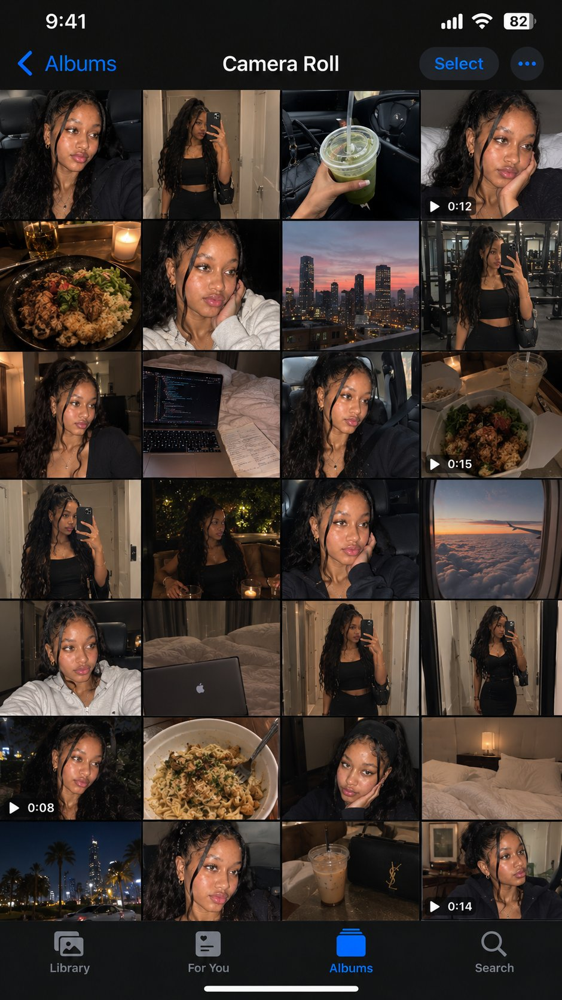

# One-Line iPhone Camera Roll Interface

**中文标题：** 一句话出 iPhone 相机胶卷界面  
**ID:** `gi25-x-552` · **Mode:** `edit`  
**Categories:** `ui-mockup`  
**Tags:** `x-twitter`, `community`, `gpt-image-2.5`, `xianyu`, `en`



### One-Line iPhone Camera Roll Interface

```text
Turn one full day's worth of camera roll for the person in the reference image into a single image that captures the iPhone's Photos app screen as-is. Make it a realistic camera roll that feels like it captures casual everyday moments 9:16 aspect ratio.
```

- **Recommended model:** `gpt-image-2.5-sunburst`
- **Settings:** _(defaults)_
- **Source:** [community](https://x.com/Kel_vinleven/status/2099419041672699933) — @Kel_vinleven (via xianyu110/awesome-gpt-image2.5)
- **License note:** Community X post mirrored in xianyu110/awesome-gpt-image2.5; remix with attribution
- **Notes:** xianyu110 case 2099419041672699933; category=UX产品; verified=True
- **Preview:** `previews/gi25-x-552.jpg`
