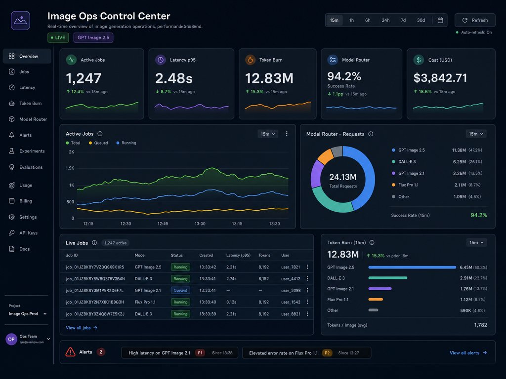

# Dark SaaS Analytics Dashboard UI

**中文标题：** 暗色 SaaS 数据看板 UI  
**ID:** `gi25-x-590` · **Mode:** `generate`  
**Categories:** `ui-mockup`  
**Tags:** `x-twitter`, `community`, `gpt-image-2.5`, `atlascloud`, `en`



### Dark SaaS Analytics Dashboard UI

```text
Dark SaaS analytics dashboard UI titled Image Ops Control Center, crisp labels Active Jobs Latency p95 Token Burn Model Router, pills LIVE and GPT Image 2.5, dense legible microcopy 4k
```

- **Recommended model:** `gpt-image-2.5-sunburst`
- **Settings:** _(defaults)_
- **Source:** [community](https://x.com/PoyoAPI/status/2097666167238259048) — @PoyoAPI (via AtlasCloudAI/awesome-gpt-image-2.5-prompts)
- **License note:** CC BY 4.0 (AtlasCloudAI/awesome-gpt-image-2.5-prompts); original X post — remix with attribution
- **Notes:** AtlasCloudAI record 25; category=Layout & Typography; prompt text taken from the original X post; verified=True
- **Preview:** `previews/gi25-x-590.jpg`
