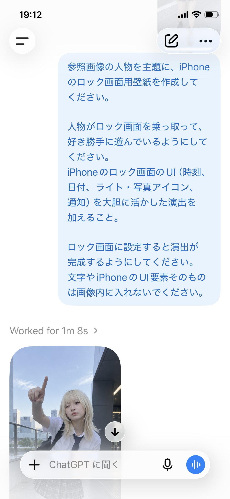

# Character Lock-Screen Takeover

**中文标题：** 角色接管锁屏壁纸  
**ID:** `gi25-x-620` · **Mode:** `edit`  
**Categories:** `ui-mockup`, `edit-change-preserve`, `general`  
**Tags:** `x-twitter`, `community`, `gpt-image-2.5`, `bravoneo`, `ja`



### Character Lock-Screen Takeover

```text
参照画像の人物を主題に、iPhoneのロック画面用壁紙を作成してください。

人物がロック画面を乗っ取って、好き勝手に遊んでいるようにしてください。
iPhoneのロック画面のUI（時刻、日付、ライト・写真アイコン、通知）を大胆に活かした演出を加えること。

ロック画面に設定すると演出が完成するようにしてください。
文字やiPhoneのUI要素そのものは画像内に入れないでください。
```

- **Recommended model:** `gpt-image-2.5-sunburst`
- **Settings:** _(defaults)_
- **Source:** [community](https://x.com/sakisuta_/status/2099786676751225192) — @sakisuta_ (via BravoNeo/awesome-gpt-image-2-5-prompts)
- **License note:** Original X post credited via BravoNeo/awesome-gpt-image-2-5-prompts (third-party source, no new license granted); remix with attribution
- **Notes:** BravoNeo entry x-2099786676751225192; use=image-editing,wallpapers; style=graphic-design; prompt matches original X post text; verified=True
- **Preview:** `previews/gi25-x-620.jpg`
