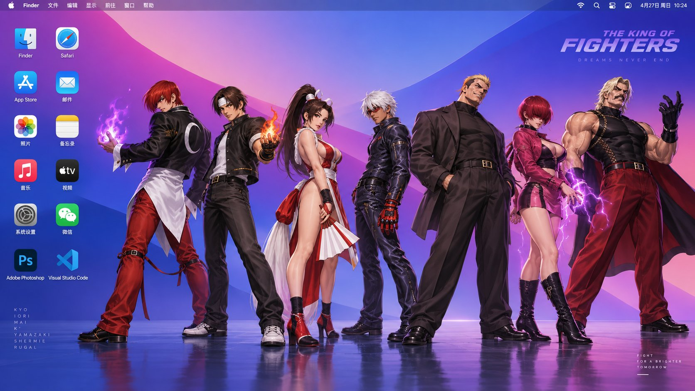

# macOS Desktop with Fighting-Game Characters

**中文标题：** 格斗角色macOS桌面  
**ID:** `gi25-x-627` · **Mode:** `generate`  
**Categories:** `ui-mockup`, `general`  
**Tags:** `x-twitter`, `community`, `gpt-image-2.5`, `bravoneo`, `zh`



### macOS Desktop with Fighting-Game Characters

```text
生成一张macOS的桌面图，左边是两列常用APP的图标，右边是格斗天王中八神庵，草稚京，不知火舞，K， 山崎龍二， 雷之夏尔米， 卢卡尔·伯恩斯坦非常经典的全身图，背景是苹果电脑经典的渐变简洁背景，16：9
```

- **Recommended model:** `gpt-image-2.5-sunburst`
- **Settings:** _(defaults)_
- **Source:** [community](https://x.com/aidavid125/status/2103382102347784199) — @aidavid125 (via BravoNeo/awesome-gpt-image-2-5-prompts)
- **License note:** Original X post credited via BravoNeo/awesome-gpt-image-2-5-prompts (third-party source, no new license granted); remix with attribution
- **Notes:** BravoNeo entry x-2103382102347784199; use=wallpapers; style=graphic-design; prompt matches original X post text; verified=True
- **Preview:** `previews/gi25-x-627.jpg`
