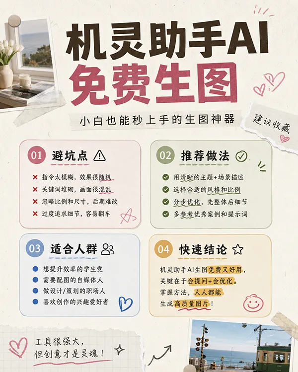

# Xiaohongshu saveable collage cover

**中文标题：** 小红书收藏型拼贴封面  
**ID:** `gi25-xhs-007` · **Mode:** `generate`  
**Categories:** `xiaohongshu`  
**Tags:** `collage`, `cover`, `jiling`  



### Xiaohongshu saveable collage cover

```text
生成一张适合小红书发布的竖版收藏型封面，主题是：机灵助手AI免费生图。画面要一眼可读、强停留、强收藏，顶部放大标题，标题控制在 8-12 个中文字符，副标题为。中间用 4 个圆角信息模块展示：避坑点、推荐做法、适合人群、快速结论。整体像真实博主做的高质感内容封面，干净浅色背景，手写标注、小贴纸、局部照片拼贴、轻微纸张纹理，不要做成广告海报。中文文字尽量清晰，不要乱码。
```

- **Recommended model:** `gpt-image-2.5-flare`
- **Settings:** `size=1024x1536`
- **Source:** [Community](https://docs.jiling.cc/templates/xiaohongshu-saveable-cover.html) — 机灵助手 / docs.jiling.cc
- **License note:** template page; reuse with attribution
